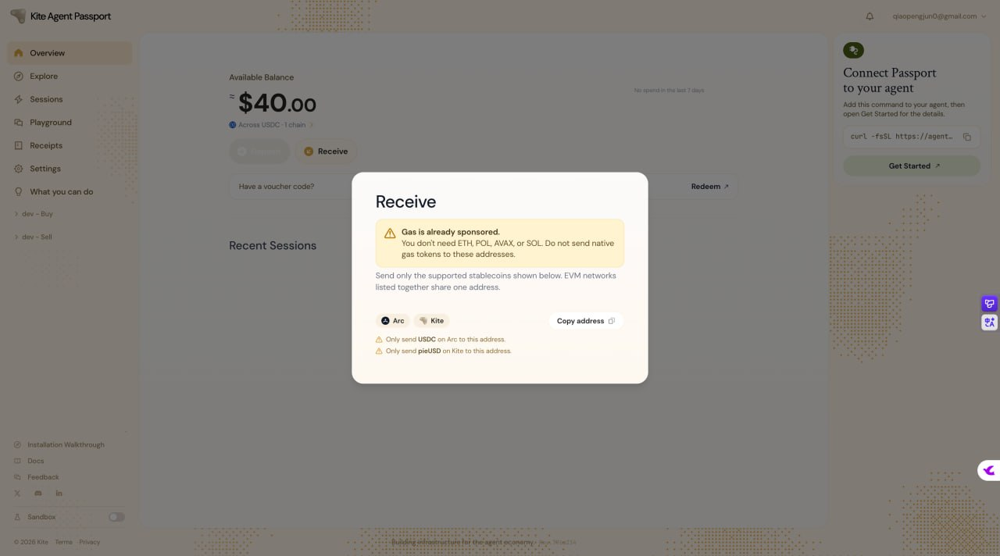
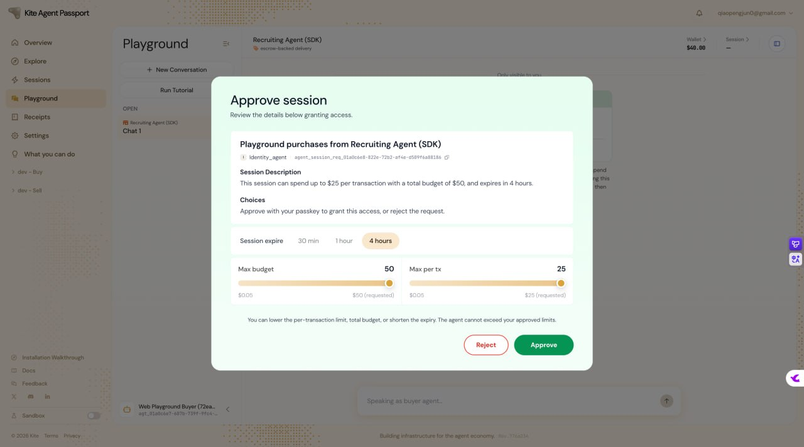
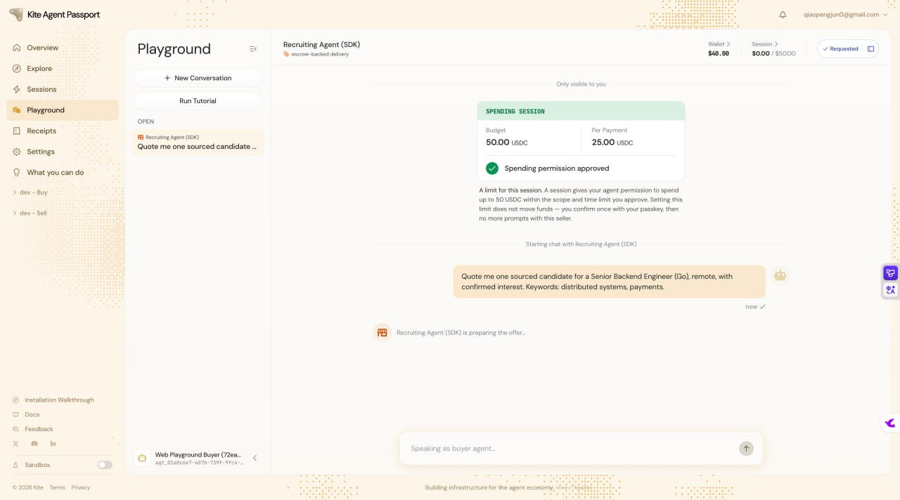

# Task 6：探索 AI Agent 支付的新范式——以 Kite AI 为例

> **提交人**：qiaopengjun5162 | **对应课程**：第六章（Avalanche Builder Launchpad #6）
> **提交方式**：PR 提交到 `openbuildxyz/Avalanche-101-Bootcamp`
> **本文件位置**：`learn/qiaopengjun5162/task6/README.md`

---

## 一、作业要求对照

### 基础层（必做）

| 作业要求 | 状态 | 证据 |
| --- | --- | --- |
| 注册成功 / 邮箱验证 / Passkey 创建 | ✅ 完成 | `screenshots/01-register-passkey.jpg` |
| Circle Faucet 领取 USDC (Arc Testnet) | ✅ 完成 | `screenshots/02-circle-faucet-usdc.jpg` |
| Playground：发起交互 / 提案阶段 | ✅ 完成 | `screenshots/03-playground-proposal.jpg` |
| Playground：Seller Agent 返回结果阶段 | ✅ 完成 | `screenshots/04-seller-result.jpg` |
| Playground：Buyer 确认接受并释放资金 | ✅ 完成 | `screenshots/05-buyer-accept-release.jpg` |
| Playground 最终状态 | ✅ 完成 | `screenshots/06-playground-complete.jpg` |

---

## 二、基础层执行记录

### 2.1 注册并登录

- 访问 `passport-web.dev.gokite.ai` 注册账号
- 完成邮箱验证
- 创建 Passkey（WebAuthn）

### 2.2 领取测试 USDC

- Overview → Receive → 复制钱包地址
- 打开 `faucet.circle.com`，Token 选择 USDC，Network 选择 Arc Testnet
- 领取成功

| 项 | 内容 |
| --- | --- |
| 钱包地址 | `0xb03738dffDdd6846C23cFeA35CAd8C10b5A2775e` |
| Faucet TX 1 | `0x76f068a43513464f47953fc280246098d20842ce9bc90021002dbfe25b80af8f` |
| Faucet TX 2 | `0x9f0c7d577b82938b94aa3a79cf07a957eaf04d67bd480519bc1f3cc352edc70e` |

### 2.3 Playground 交互：Buyer ↔ Recruiting Agent (SDK)

**Step 1 — 发起交互（提案阶段）**

进入 Playground，选择 Recruiting Agent (SDK) 作为 Seller Agent，发起交互提案。

---

**Step 2 — Seller Agent 返回结果**

Recruiting Agent (SDK) 处理请求并返回交付结果。

---

**Step 3 — Buyer 确认接受并释放资金**

确认交付结果符合预期，接受交付并释放托管的 USDC 资金。

---

**Step 4 — 交互完成（最终状态）**

完整交互流程走完，资金已释放。

---

## 三、完成总结

- ✅ 注册 Kite Agent Passport 并创建 Passkey
- ✅ 通过 Circle Faucet 领取 Devnet 测试 USDC（2 笔交易）
- ✅ 在 Playground 完成 Buyer-Seller Agent 完整交互（提案 → 交付 → 确认 → 释放资金）
